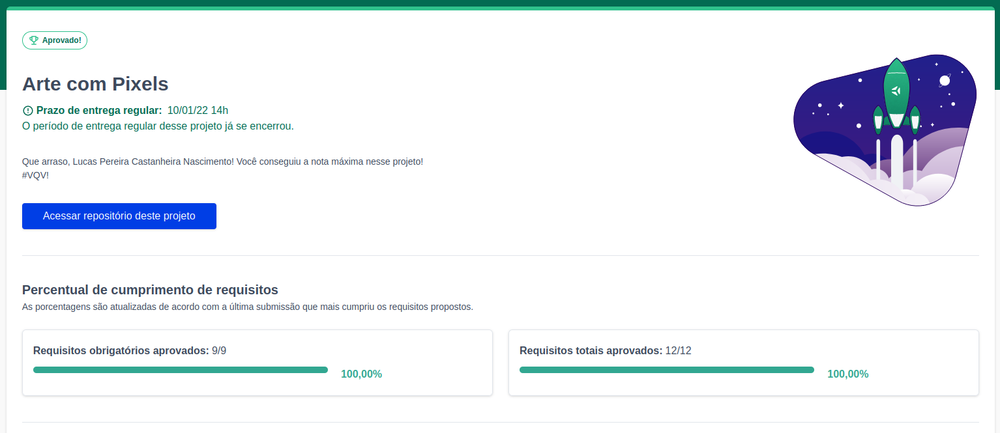
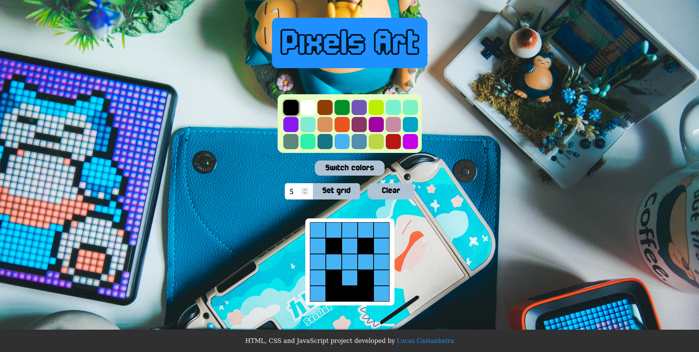

# Pixels Art

<h2>:brazil: Português :brazil:</h2>

Projeto entregue durante o curso de desenvolvimento Web ministrado pela <a href="https://www.betrybe.com" targe="_blank" rel="nofollow">Trybe</a>.

Obtive a aprovação no projeto, completando 100% dos requisitos obrigatórios e opcionais. Efetivando, assim, a conclusão do Bloco 5 (JavaScript: DOM, Eventos e Web Storage) referente ao Módulo 1 (Fundamentos do Desenvolvimento Web).

Descrição:

O projeto tinha como objetivo desenvolver uma página web que contém uma paleta de cores funcional que poderá ser utilizada para criar desenhos em pixels. Para isto foi utilizado javascript, css e html.

Habilidades desenvolvidas

<ul>
<li>Manipular o DOM</li>
<li>Manipular o JavaScript</li>
</ul>

Link para conferência: https://Lucas-PCN.github.io/pixels-art/

<a href="https://www.linkedin.com/in/lucas-pereira-castanheira-nascimento-238355190/" targe="_blank" rel="nofollow">Meu Linkedin</a>.

 

<h2>:us: English :us:</h2>

Project delivered during the Web development course taught by <a href="https://www.betrybe.com" targe="_blank" rel="nofollow">Trybe</a>.

I passed the project, completing 100% of mandatory and optional requirements. Thus, completing Block 5 (JavaScript: DOM, Events and Web Storage) referring to Module 1 (Fundamentals of Web Development).

Description:

The project aimed to develop a web page that contains a functional color palette that can be used to create pixel drawings. For this, javascript, css and html were used.

Developed skills

<ul>
<li>Manipulate the DOM</li>
<li>Handle JavaScript</li>
</ul>

Conference link: https://Lucas-PCN.github.io/pixels-art/

<a href="https://www.linkedin.com/in/lucas-pereira-castanheira-nascimento-238355190/" targe="_blank" rel="nofollow">My Linkedin</a>.

